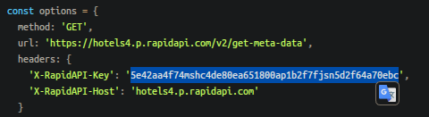

# Запуск бота.
* Ввести в терминал из корня проекта:
    * `pip install -r requirements.txt`
* Получить токены
    * Telegram - [тык](https://t.me/BotFather)
    * Rapid Api - [Тык](https://rapidapi.com/apidojo/api/hotels4/) 
      * Зарегаться 
      * Нажать на кнопку "Subscribe to Test"
      * Выбрать тариф
      * Скопировать ваш токен
      * 
* Создать в корне проекта файл `.env` по образцу [.env.template](.env.template)
* Запустить [main.py](main.py)